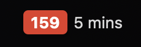
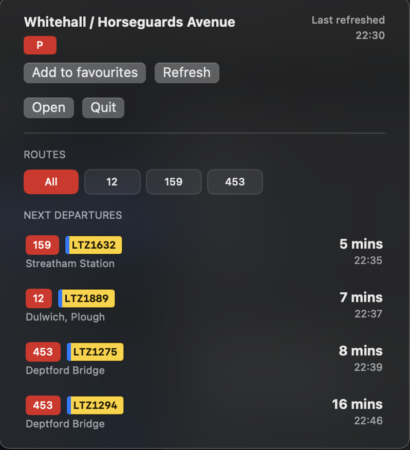
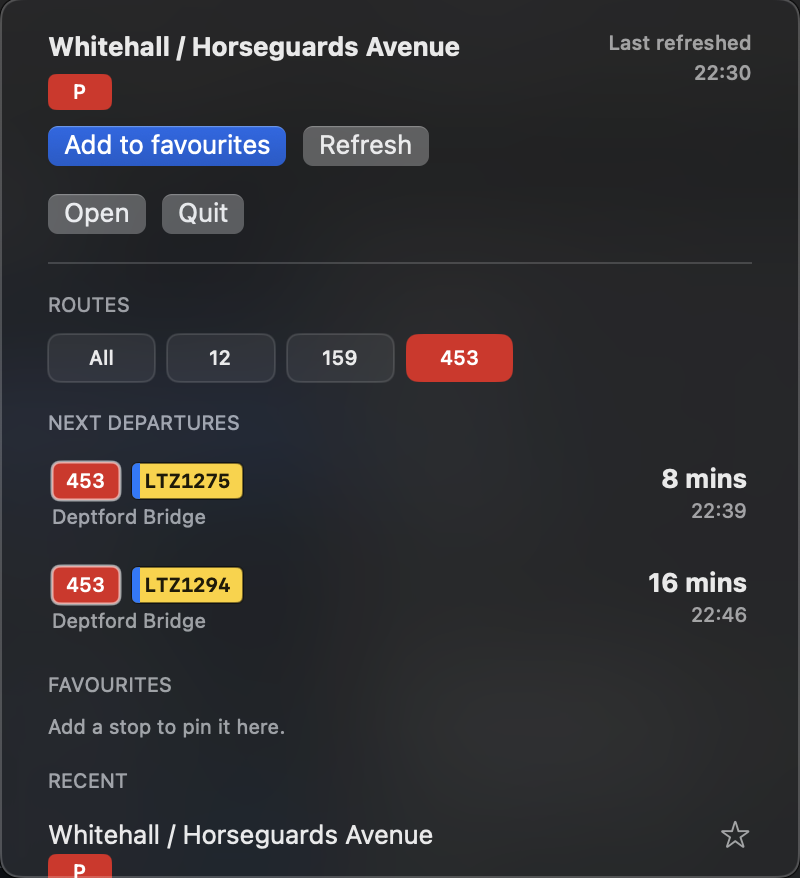
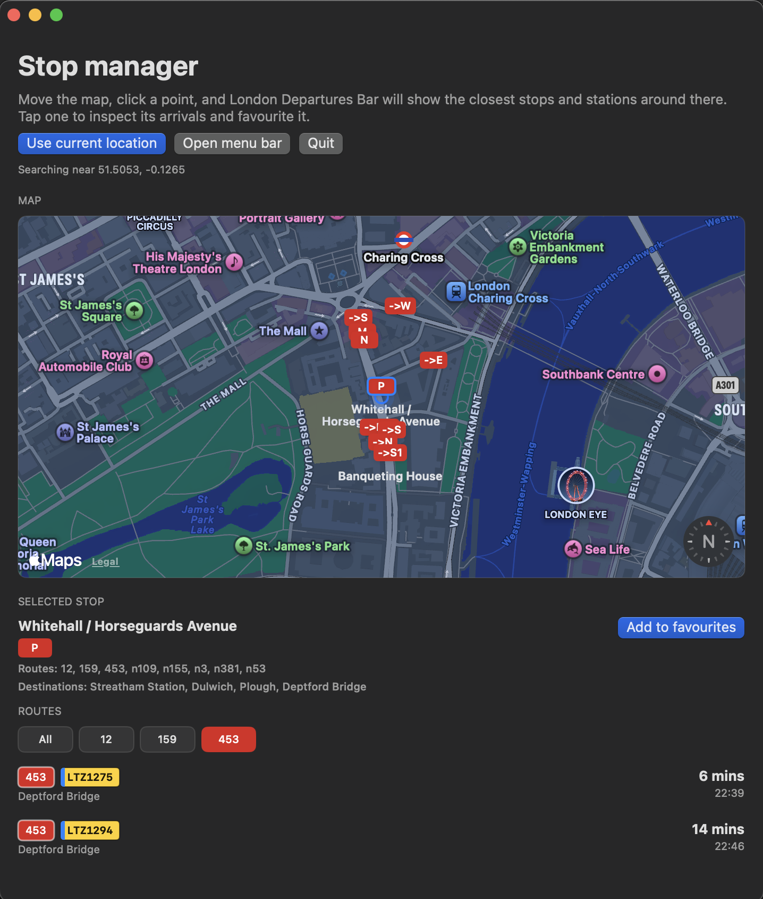

# London Departures Bar

London Departures Bar is a lightweight macOS menu bar app for live public transport departures around London. It keeps the next service visible in the menu bar and opens into a compact departures board for nearby stops and stations.



## What It Does

- Shows the next live departure directly in the macOS menu bar.
- Uses transport-coloured badges for buses, trams, Tube lines, DLR, Overground, Elizabeth line, and National Rail.
- Opens a compact popover with the selected stop, live departures, refresh state, favourites, and recent stops.
- Filters departures by route, destination, or National Rail platform.
- Displays bus vehicle IDs as plate-style labels when TfL provides them.
- Saves selected stops, favourites, recent stops, cached nearby stops, and active filters between launches.
- Refreshes live data every 60 seconds and updates countdown labels every 15 seconds.





## Stop And Station Discovery

- Finds nearby TfL stops and stations from the TfL StopPoint API.
- Includes buses, trams, Underground, DLR, Overground, Elizabeth line, and rail stations exposed by TfL.
- Provides a standalone map window for exploring stops around any clicked point.
- Can request the current macOS location permission to jump the map to nearby transport.
- Shows route and destination summaries for the selected stop.
- Lets you favourite stops from the popover or map window.



## Live Data Sources

- TfL arrivals come from the TfL StopPoint arrivals endpoint.
- Route metadata comes from the TfL StopPoint route endpoint.
- National Rail departures use Huxley as a fallback when TfL does not return rail predictions.

## Privacy

- Location lookup is optional and only starts after clicking `Use current location`.
- Nearby-stop searches send the selected map coordinate or current-location coordinate to the TfL StopPoint API.
- National Rail fallback departures are requested from Huxley when TfL does not return rail predictions.
- Selected stops, favourites, recents, cached nearby stops, and active filters are stored locally in macOS `UserDefaults`.
- The app does not include analytics, advertising, or a developer-operated backend.

## Requirements

- macOS 14 or later
- Swift 6 toolchain
- Network access to TfL APIs
- Network access to Huxley for National Rail fallback data

## Run From Source

Open the folder in Xcode as a Swift package, or run:

```bash
swift run
```

## Build The App Bundle

To refresh the local `London Departures Bar.app` bundle with a release build:

```bash
./scripts/build-app.sh
open -n "London Departures Bar.app"
```

The build script compiles the Swift package in release mode, copies the executable into `London Departures Bar.app`, and applies an ad-hoc code signature.

## Usage

Launch `London Departures Bar.app`, then click the menu bar item to open the departures popover. Use favourites and recents to switch stops quickly, or open the map window to find nearby stops and stations.

Click a route, destination, or platform badge to filter the departure list. Click the badge again to remove that filter, or use `All` to show every available departure for the selected stop.

## Project Layout

- `Sources/LondonDeparturesBar/main.swift` contains the app entry point, store, API models, menu bar controller, popover UI, and map window.
- `scripts/build-app.sh` builds and signs the local app bundle.
- `Assets/AppIcon.svg` and `Assets/AppIcon.icns` provide the app icon.
- `Assets/menu-bar-status.png`, `Assets/departures-popover.png`, `Assets/route-filter-popover.png`, and `Assets/stop-manager-map.png` provide README screenshots.
- `Packaging/Info.plist` provides the macOS app bundle metadata.

## Name

The app used to be called `BusBar`. `London Departures Bar` better describes the current app: a menu bar departures board for London transport, not just a bus tracker.

The Swift package and executable target use `LondonDeparturesBar`, while the visible macOS app bundle is `London Departures Bar.app`.

## Public Release Note

The default stops are neutral central London examples. For a public repository, start from a clean working tree or a fresh local repository so old private stop data is not present in Git history.

Release builds should be signed and notarized before distribution. The local build script uses an ad-hoc signature for development builds.
